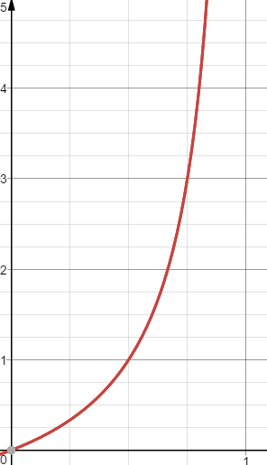
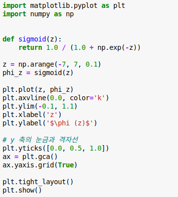
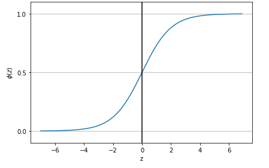
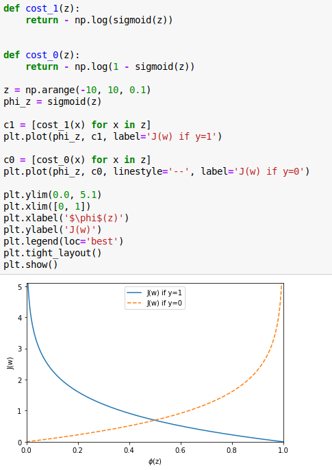

#  3.3 로지스틱 회귀를 사용한 클래스 확률 모델링

퍼셉트론 규칙은 간단하고 좋은 모델이지만 단점 : 클래스가 선형적으로 구분되지 않을 때 수렴할 수 없다

에포크 마다 적어도 하나의 샘플이 잘못 분류되기 때문에 가중치 업데이트가 끝도 없이 계속 됨

학습률 에포크 횟수를 변경하여도 이 데이터셋에 절대 수렴하지 못한다.

## 3.3.1 로지스틱 회귀의 이해와 조건부 확률

퍼셉트론 규칙의 단점으로 이보다 더 강력한 다른 알고리즘을 로지스틱 회귀 를 살펴보았다.

로지스틱 회귀는 구현하기 매우 쉽고 선형적으로 구분되는 클래스에 뛰어난 성능을 내는 분류 모델

이진 분류를 위한 선형 모델이지만 다중 분류로 확장이 가능 (OvR방식 사용)

오즈(odds)

오즈비는 임의의 사간 A가 발생하지 않을 확률 대비 일어날 확률의 비율을 뜻하고 그 식은 아래와 같다. 
$$
odds = \frac{P(A)}{P(A^{C})}=\frac{P}{1-P}
$$

만약 P(A)가 1예 가까울수록 odds는 발산할것이고 반대로 0으로 갈수록  0으로 수렴 할 것입니다.(p의 범위가 (0,1)일때 odds는  (0,∞))

이 확률값은 계수들에 대해 비선형이기 때문에 선형으로 변환하기 위하여 자연로그를 취합니다. 이로 오즈비에 (로그 오즈)를 취해 로짓 함수를 정의합니다. 

$$
logit(P)=log\frac{P}{1-P}
$$
여기서 logit 함수는 0과 1 사이의 입력 값을 받아 실수 범위 값을 변환합니다.

특성의 가중치 함과 로그 오즈 사이의 선형 관계를 다음과 같이 쓸 수 있습니다.
$$
logit(P(y=1|x)) = w_0x_0 +w_1x_1+...+w_mx_m = \sum_{i=0}^{m}{w_ix_i}=\mathbf{w}^T\mathbf{x}
$$
여기서 P(y=1|x)는 특성 x가 주어졌을 때 이샘플이 양의 샘플 클래스 레이블 1에 속할 조건부 확률입니다.

어떤 샘플이 특정 클래스에 속할 활률을 예측하는 것이 관심 대상이므로 logit 함수에 역함수를 취하면 **시그모이드 함수**(sigmoid funcion)가 됩니다.
$$
\phi(z)=\frac{1}{1+e^{-z}}
$$

np.arange 는 반열린구간에서 step의 크기만큼 일정하게 떨어져 있는 숫자들을 array 형태로 반환해주는 함수

즉 ,-7에서 7까지 0.1 씩 나누어 z 값으로 반환

예측 확률은 임계 함수를 사용하여 이진 출력으로 변환
$$
\hat y =\begin{cases} 1 \quad \phi(z)\geq0.5일 때 \\0 \quad 그외 \end{cases}
$$
또는
$$
\hat y =\begin{cases} 1 \quad z\geq0.0일때 \\0 \quad 그외 \end{cases}
$$

## 3.3.2 로지스틱 비용 함수의 가중치 학습

2장에서 다음과 같은 제곱 오차합 비용 함수를 정의 했습니다.
$$
J(\mathbf{w}) = \sum_{i}{\frac{1}{2}(\phi(z^{(i)})-y^{(i)})^2}
$$

비용함수를 유도하는 방법을 설명하기 위해 먼저 로지스틱 회귀 모델을 만들 떼 최대화하려는  가능도 L을 정의 하겠습니다. 각 샘플은 독립적이라 가정합니다.
$$
L(\mathbf{w})=P(\mathbf{y}|\mathbf{x};\mathbf{w})=\prod_{i=1}^n P(y^{(i)}|\mathbf{x^{(i)};\mathbf{w}})=\prod_{i=1}^n \Bigl(\phi(z^{(i)})\Bigr)^{y^{(i)}} \Bigl( 1-\phi(z^{(i)})\Bigr)^{1-y^{(i)}}
$$

이 식에 로그를 취하면 로그 가능도 함수라고 합니다.
$$
l(\mathbf{w})=logL(\mathbf{w})=\sum_{i=1}^n\biggl[y^{(i)}log\Bigl(\phi(z^{(i)})\Bigr)+\Bigl(1-y^{(i)}\Bigr)log\Bigl(1-\phi(z^{(i)})\Bigr)\biggr]
$$

- 첫째 : 로그 함수를 적용 하면 가능도가 매우 작을 때 일어나는 수치상의 언더플로를 미연에 방지 합니다.

- 둘째 : 계수의 곱을 계수의 합으로 바꿀 수 있습니다.

경사 상승법 같은 최적화 알고리즘을 사용하여 이로그 가능도 함수를 최대화 할 수 있습니다.

또는 로그 가능도 함수를 다시 비용함수 J로 표현하여 경사하강법을 사용하여 최소화할 수 있습니다.
$$
J(\mathbf{w})=\sum_{i=1}^n\biggl[-y^{(i)}log\Bigl(\phi(z^{(i)})\Bigr)-\Bigl(1-y^{(i)}\Bigr)log\Bigl(1-\phi\Bigr(z^{(i)}\Bigr)\Bigr)\biggr]
$$
샘플이 하나일때 비용은
$$
J(\phi(\mathbf{w}),y;\mathbf{w})=\begin{cases}-log(\phi(z))\quad\quad \quad \quad  y=1 일때 \\-log(1-\phi(z))\quad \quad y=0일때 \end{cases}
$$

x  축은 시그모이드 활성화 값, y축은 로지스틱 비용

img